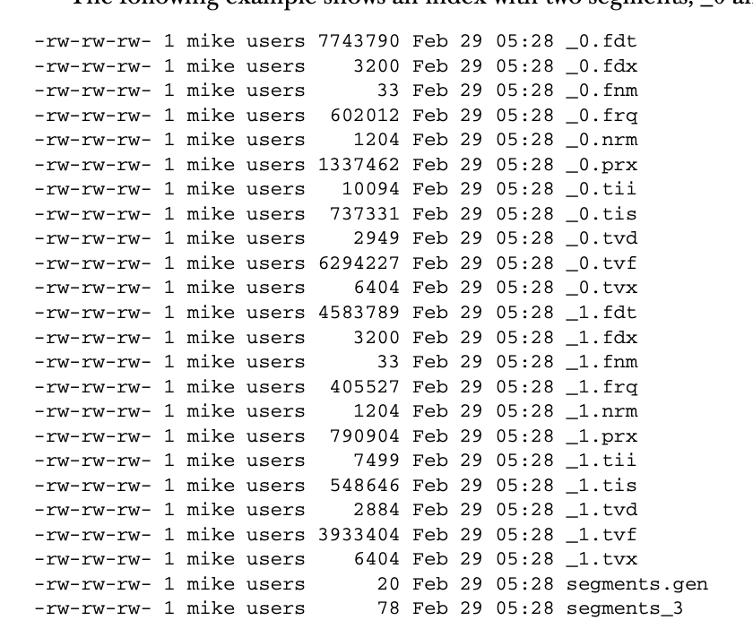
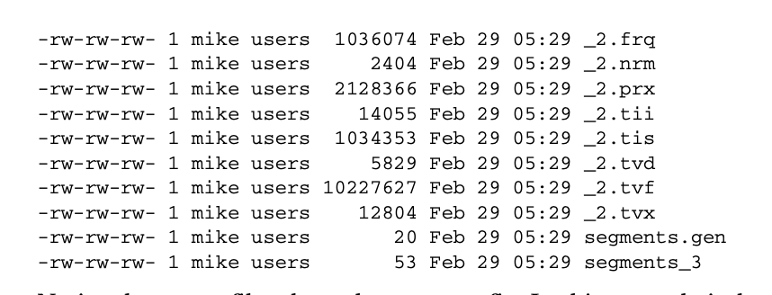

# Lucene 색인 

- 다룰 내용은 다음과 같다.
  - 색인 내용을 변경하는 방법 
  - 색인 작업을 튜닝하는 방법 
  - 루씬의 색인이 어떻게 구성되는지, 루씬의 고급 기능들. 
  - 루씬의 색인 API 에서 제공하는 트랜잭션 기능
  - 하나의 색인들 동시에 여러 스레드에서 접근하지 못하도록 하는 락 기법들
- 색인의 목표를 잊어서는 안된다. 사용자들에게 더 나은 검색 경험을 제공해주기 위해서 존재한다는 사실을. 
  - 그래서 구체적인 색인 설정 하나 둘 보다는 더 나은 검색 기능을 제공하는게 나을 수도 있다.

## 루씬 데이터 모델

- 문서 (Document) 는 색인과 검색의 단위이다. 
  - 문서를 가지고 색인을 하며, 검색을 했을 때 문서가 반환된다.
  - 문서는 여러개의 필드르 가지고 있다. 이걸 바탕으로 색인과 검색이 된다. 
  - 루씬이 각 필드를 다루는 방법은 다음과 같이 3 가지가 있다.
    - 필드를 색인 하는 경우
    - 필드를 색인하지 않는 경우
    - 색인과 관계없이 필드의 정보를 저장하는 경우. 
      - 색인헀던 정보를 사용자에게 그대로 보여주기 위한 것.
      - 논문의 초록이나 문서의 제목과 같은 것.
      - 텍스트가 분석 절차를 거치지 않고 그대로 저장되는 형태를 말한다. 나중에 불러와서 쓰기 위한 것이라는데.

## 루씬의 색인 절차 

- 루씬의 색인 절차는 다음과 같다. 
  - 원본 문서에서 텍스트 추출 -> 분석 -> 색인 
  - 즉 원본 문서에서 텍스트를 추출해서 Fields 를 만들고 이를 바탕으로 Document 를 만든다. 
    - 이 Document 를 만드는 방법은 때때로 어렵다고 한다. 그냥 txt 파일이 아니라 PDF 파일이나 MS Word 파일인 경우도 있으니까. 
  - 이 Document 를 가지고 분석을 한다. Document 안에 있는 Fields 를 분석하겠지. 분석을 하면 토큰 스트림 형태로 결과가 나오게 된다.
    - `IndexWriter.addDocument(document)` 과정을 통해서 분석이 시작된다. 
    - 필드안에 있는 텍스트는 토큰으로 변환되며 가공되어진다. 
      - `LowercaseFilter` 를 통해서 소문자로 변경되기도 하고, `StopFilter` 를 통해 의미없는 문자는 제거되기도 한다. 그리고 `PorterStemFilter` 를 통해서 각 토큰을 해당 단어의 기본형으로 변경되기도한다.
      - 지금까지 말한 필터는 토큰 필터이다.
      - 분석과 필터등에 대한 작업은 4장에서 자세하게 설명한다는 듯.
  - 이 토큰 스트림은 세그먼트 구조의 색인에 토큰이 하나씩 들어가게 된다. 
    - 텍스트 -> 토큰으로 변환되고 이게 역색인에 저장된다.
    - 역색인은 문서를 토큰을 기반으로 조히할 수 있도록 한다
    - 그리고 루씬의 하나의 색인은 다수의 세그먼트를 가지게 되는 구조다.

### 세그먼트 구조의 색인이 뭘까? 

- 일단 세그먼트를 알아보자.
  - 루씬의 색인은 다수의 세그먼트로 이뤄져있다고 함.  
  - 각 세그먼트는 그 자체로 개별적인 색인이라고 함. 검색 색인에 들어있는 문서 중 일부를 담고 있음. (이래서 세그먼트인가.)
  - IndexWriter 에서 추가하거나 삭제한 문서를 버퍼에 담아두고 있는데 플러쉬하면 새로운 새그먼트가 생성된다. 
  - 그리고 검색할 때는 세그먼트를 하나씩 조회한 후 결과를 하나로 합쳐서 넘겨준다고 하낟.
  - 하나의 세그먼트는 여러 종류의 파일을 포함하고 있다고 한다. 
    - 텀 벡터를 담고 있는 파일 
    - 저장된 필드를 담고 있는 파일 
    - 역 파일 색인을 담고 있는 파일
    - 그리고 각 파일은 `X.확장자` 형태로 이뤄져있고 파일의 기능에 따라 확장자가 달라지며 `X` 의 이름이 세그먼트의 이름이다.
      - 통합 색인 형식을 이용하고 있다면 세그먼트의 모든 파일 형식이 `X.cfs` 파일안에 깔끔하게 들어있다고 함.
      - 통합 색인이 기본 값이며 세그먼트마다 하나의 파일을 쓰도록 함. 운영체제에서 파일의 개방 개수를 줄이는 효과가 있다고 한다.
        - (파일 개방 개수와 성능이 영향이 있다고 한다. 이건 11장에서 본다고 하는듯.)
  - `segment<N>` 이름의 특별한 세그먼트가 있는데 이는 해당 색인을 구성하는 모든 세그먼트에 대한 참조가 있다고 한다.
    - 그래서 색인을 열 때 가장 먼저 읽는 파일이라고 한다. 
    - `<N>` 의 이름은 generation (세대) 라는 뜻이다. 색인에 변경사항이 반영될 때마다 하나씩 증가된다. 
  - 시간이 지나고 색인을 사용할 수록 점점 더 많은 세그먼트가 쌓인다고 한다.
    - IndexWriter 클래스를 자주 사용하면 세그먼트의 개수가 늘어난다고 한다. 
    - *(왜 IndexWriter 를 쓰면 세그먼트의 개수가 늘어나는거지?)*
      - 문서를 많이 색인하면 세그먼트가 늘어날 수 있기 떄문에 그런듯.  
    - 늘어나도 상관이 없다고 하는데 IndexWriter 가 주기적으로 세그먼트를 병합하기 때문에.
      - 병합할 세그먼트는 `MergePolicy` 클래스를 따라서 선택된다. 
      - 병합으로 선정된 세그먼트는 `MergeScheduler` 클래스를 따라서 지정된 시점에 실제로 반영된다.
  - *(세그먼트라는 이름의 색인의 일부만 포함하고 있어서 그런건가?)*
    - ㅇㅇ 부록 보니 맞는 거 같음. 

#### 실제 Segment 파일을 보자. (부록 참조.)   

- `_0` 과 `_1` 그리고 `_2` 로 시작되는 파일들은 각각이 세그먼트들이다. 세그먼트가 여러개의 파일로 나눠진 것이다. 
- 루씬의 색인은 다중 파일과 통합 파일 두 종류의 형식으로 지원한다고 한다. 
  - 다중 파일이 통합 파일보다 여는 파일 개수가 더 많다. 이게 문제가 될 수 있다는 듯. 
  - 지금 것이 다중 파일 형식이다. 같은 세그먼트, 그리고 여러 확장자를 가진 파일들로 이뤄진 형태. 
    - 이 파일을 건들면 전체 색인을 다시 해야할 수도 있다. 
  - 통합 파일은 `zip` 처럼 세그먼트가 하나의 파일로 이뤄진 형태를 말한다. 
  - 형식을 변경할려면 `indexWriter.setUseCompoundFiles(boolean)` 를 통해서 변경하면 된다. 
  - 실제로 읽는 파일은 `fdx, fdt` 등의 파일만 주로 읽는 다는 듯. 
- 세그먼트는 완전히 독립적인 색인은 아니지만 부분 색인이라고 생각하면 된다.
  - `IndexWriter.addDocument(document)` 를 바탕으로 문서의 색인이 여러개가 세그먼트에 있는 구조라고 보면됨.
  - 즉 모든 문서의 색인이 세그먼트에 나눠진 형태. 
- `segment_3` 파일이 세그먼트의 정보가 담겨져있는 파일이다. 
  - 새로운 문서가 들어오고 `IndexWriter` 가 이 문서를 추가하고 커밋하면 새로운 세그먼트가 생기면서 `semgnet_4` 파일이 생성되고 `segment_3` 파일은 지워진다. 
  - *문서 한 개가 추가될 때마다 새로운 세그먼트가 생기는 것인가?*
    - ㄴㄴ 커밋은 새로운 문서와 삭제된 문서가 버퍼에 있다가 한번에 플러쉬 하는 행위이기 때문에 문서 한 개당 한다면 되게 비효율적임.
- `segment_gen` 이라는 파일을 통해 최종 세그먼트의 번호를 확인할 때 쓴다. 
  
### 왜 세그먼트 단위로 색인을 설계했을까? 

- 색인을 할려고 새로운 문서가 추가되었을 때 변경의 여파를 최소화 하기 위해서. (더 효율적이기 위해서지.)
  - 새로운 문서가 추가되서 새로운 세그먼트가 추가되었다고 가정해보자. 새 세그먼트와 기존의 일부 세그먼트와만 병합하면 되니까. 병합의 비용이 줄어드는거지.
- 루씬의 장점 중 하나는 새로운 문서가 들어왔을 때 전체 색인을 다시하지 않아도 된다고 한다. (일부 정보 검색 라이브러리는 다시 색인을 만들어야 한다고 하는듯.)
  - 새로운 문서만 색인을 하면 된다. (이걸 증분 색인(incremental Indexing) 이라고 한다.) 

#### 논리적인 세그먼트

- 이 구조를 보면 세그먼트 하나에 24 개의 문서를 담도록 최적화를 했다.  
- *(병합이라는게 문서의 개수를 바탕으로 하는건가? 나는 겹치는 토큰을 바탕으로 하는 건 줄 알았는데 )* 

### 역파일 색인 구조까지 보자. 

- `RAMDirectory` 를 쓰면 색인의 내용 모두를 메모리에 올리게 되고, `FSDirectory` 를 쓰게 되면 파일의 형태로 관리하게 된다. 
- 여기서는 색인 데이터가 실제로 어떻게 저장되는지 보기 위한 것. 

#### 세그먼트의 한 부분들

- `필드 이름 (.fnm)`
  - 해당 세그먼트에 포함되어 있는 **문서가 가지고 있는 모든 필드**의 이름을 가지고 있음. 
  - 각 필드는 색인할 떄 지정했던 설정 값이 함께 저장된다. 
    - 필드의 내용을 색인했는가? 
    - 텀 벡터를 사용하고 있는가? 
    - Norm 값을 저장하고 있는가? 
    - 적재한 내용이 있는가?
    - *(Norm 값과 적재했다는 뜻이 뭘까?)*
      - 원문 적재와 가중치를 말한듯. 
- `텀 사전 (tis, tii)`
  - 세그먼트의 모든 텀 (필드와 값의 쌍) 은 `.tis` 파이에 보관된다. 
  - 텀은 `UTF-16` 자바 글자 순서에 따라 필드 이름 순서대로 정렬된다. 
  - 텀 마다 문서 빈도수 (document frequency) 도 같이 저장된다.
  - `.tii` 파일은 메모리에 보관되면서 `.tis` 파일의 위치를 보관한다. 참조 목록을 담는 파일이다.
  - `.frq` 파일은 각 텀에 대해서 해당 텀을 담고 있는 문서에 대한 항목을 나타낸다.
- `텀 빈도수 (.frq)`
  - 문서 안에서틔 텀 빈도와 해당 문서에 대한 항목을 나타내는 파일. 
  - 일반적으로 텀 빈도수가 높은 문서가 더 높은 점수를 받게 된다. 
  - 그리고 문서에서 텀이 존재했던 위치는 `.prx` 파일에 보관된다. 
- `텀 위치 (.prx)`
  - 문서 내에서 텀의 위치를 나타낸다. 
  - 텀의 위치는 스팸 질의나, 구문 질의에서 사용된다. 
  - 이 위치는 토큰으로 분리할 때 토큰의 위치 증가 값으로 알게된다.
- `원문 저장 필드`
  - 특정 필드에 원문을 저장하게 설정하면 (`Fields.Store.YES`) 원문은 `.fdx` 파일과 `.fdt` 파일에 저장된다. 
  - `.fdx` 파일에는 색인 정보가 들어가고 이 값을 기준으로`.fdt` 파일에 저장된 원문 정보를 찾아낸다. 
  - 즉 `.fdt` 파일에는 원문이 들어간다고 보면 된다. 
- `텀 벡터`
  - 텀 벡터는 세 개의 파일에 나눠서 저장한다. 
  - `.tvf` 파일이 가장 크며 알파벳 순서대로 텀과 빈도수, 시작 지점과, 위치 정보 등을 모두 저장한다. 
  - `.tvd` 파일에는 특정 문서에서 텀 벡터를 갖고 있는 필드의 목록을 가지고 있다.
  - `.tvx` 파일은 문서 번호에서 `.tvf` 와 `.tvd` 파일의 해당 위치로 직접 이동할 수 있게 색인 정보를 담고 있다. 
  - *(텀 벡터를 통해 텀 리스트와 빈도를 바탕으로 문서에서 얼마나 중요한 요소인지 알 수 있지 않을까.)*
- `Norm`
  - `.nrm` 파일은 색인 과정에서 확보한 가중치 값을 나타내는 정규화 정보를 담는다. 
  - `.nrm` 파일은 문서마다 1 바이트를 할당한다. 문서의 가중치와 필드의 가중치 해당 필드의 본문 길이를 기반으로 하는 정규화 정보를 인코딩해서 담는다. 
- `삭제된 문서`
  - 특정 세그먼트에 포함된 문서를 삭제하고 싶다면 `.del` 파일이 생성된다. 
  - `.del` 파일 이름은 `_X_N.del` 형식으로 생성되며 X 는 세그먼트 번호 N 은 삭제 정보를 커밋랄 때마다 하나씩 증가하는 번호다. (세대 번호.)
  - 파일의 안에는 비트 정보가 들어가있고, 삭제된 문서에 해당하는 비틍를 모두 1 로 설정되어 있다. 
   

### 파일 개방 개수와 성능의 관계

- 통합 파일 방식이 다중 파일 방식보다 성능은 느리다. 그러나 운영체제에서 열고 닫을 수 있는 파일의 개수는 한계가 있다. 유저가 가진 권한에 따라서. 
- 그래서 다중 파일 방식을 쓰면 Too Many open files 와 같은 에러가 발생할 수 있다. 

## 색인에서 문서 삭제하는 경우 

- 색인에서 문서를 삭제하는 경우도 생길 수 있다. 
  - 신문사에서 최근 일주일간의 기사만 검색을 하도록 하는 경우
  - 원본 문서의 내용이 오래되서 변경되는 경우에 삭제하고 새로 적재하는 경우. 
- IndexWriter.deleteDocuments 를 통해서 삭제할 수 있다. 
  - deleteDocuments(term): 지정된 텀을 통해서 텀을 포함하는 모든 문서 삭제 
  - deleteDocuments(term[]): 지정된 텀 배열을 통해서 텀 배열 중 하나의 텀이라도 포함하는 모든 문서 삭제 
  - deleteDocuments(query): 지정된 질의에 해당하는 모든 문서 삭제 
  - deleteDocuments(query[]): 지정된 질의 배열에 해당하는 경우가 하나라도 있다면 문서 삭제 
  - deleteAll(): 해당 색인에 들어있는 모든 문서 삭제
- **Term 객체를 지정해서 단 하나의 문서만을 삭제할려면 색인할 떄 문서마다 구별되는 Fields 를 삽입해서 이를 기반으로 삭제하면 된다.**
  - 그리고 이 필드는 분석기를 통해서 분석되지 않도록 해야한다. 

## 색인에서 문서 적재하는 경우

- 웹 문서의 경우 HTTP 헤더 중 ETag 값을 확인해보면 해당 문서가 변경되었는지 알 수 있다.
- **상황에 따라 색인된 문서의 특정 필드만 변경되는 경우가 있다. 근데 루씬은 특정 필드만 변경하는 기능을 지원하지는 않는다.** 
  - *그럼 지우고 새로 만들어야함?* 
    - ㅇㅇ 그래야 한다네. 즉 변경되지 않은 부분도 다시 추가해야함.
- 하지만 IndexWriter 는 갱신하는 메소드를 제공해주긴한다. (내부적으로는 지우고 다시 색인할거임.)
  - IndexWriter.updateDocument(term, document)
  - IndexWriter.updateDocument(term, document, analyzer)

## 필드별 설정 

- Fields 클래스가 색인할 떄 핵심 클래스다. 여기에 색인할 텍스트 (=데이터) 가 있기 떄문에.
- **Fields 인스턴스를 생성할 때 텍스트 뿐 아니라 색인 과정에서 루씬이 해당 필드의 내용을 대상으로 처리해야 할 작업과 설정도 저장할 수 있다.** 
  - 설정은 기능에 따라 구분할 수 있다. 
  - 색인 관련 설정 
  - 저장 관련 설정 
  - 텀 벡터 관련 설정 등의 순서 

- 색인 관련 설정 
  - 루씬이 역색인 파일을 만들 때 처리하는 방법을 설정한다.
  - 설정은 다음과 같다.
    - `Index.ANALYZED`
      - 필드에 지정된 텍스트를 분석기에 넘겨서 토큰을 뽑고 토큰을 통해서 검색할 수 있도록 한다. (내가 알던 것.)
    - `Index.NOT_ANALYZED`
      - 필드에 지정된 텍스트를 검색할 수 있게 하지만 토큰으로 분석할 수 있게 하지는 않는다. 
      - 즉 분석기로 텍스트를 처리할 수 없다.
      - 텍스트 전체가 색인된다고 보면 된다. 
    - `Index.ANALYZED_NO_NORMS`
      - Index.ANALYZED 와 비슷한 설정이지만 norm 값을 색인에 저장하지 않는다. 
      - norm 값은 색인할 떄 지정했던 중요도를 색인에 보관하는 걸 말한다. (문서의 중요도, 필드의 중요도 등)
    - `Index.NOT_ANALYZED_NO_NORMS`
      - Index.NOT_ANALYZED 와 비슷한 설정이지만 norm 값을 색인에 저장하지 않는다.
    - `Index.NO`
      - 해당 필드에 지정한 본문 텍스트는 색인하지 않는다.

- 필드의 원문 저장 관련 설정 
  - 필드의 본문 저장하는 설정 (`Fields.Store.*`) 을 쓰면 색인 시점에 원문도 같이 저장할 수 있다. 
  - 텍스트를 색인에 저장해두면 문서 결과로 가져올 때 받아온 문서에서 원래 텍스트를 그대로 가져올 수 있다. 
  - *원래 문서에서 본문은 가져올 수 있는거 아닌가?*
    - 아 검색에는 사용하지만, 결과 문서에서 보여줄 필요가 없는 경우에는 저장하지 않는다. 
    - 웹페이지 본문인 경우. 링크와 문서 일부, 제목만 있으면 되니까. 
  - 설정은 두 가지다. 저장하는 설정인 `Store.YES` 와 저장하지 않는 `Store.NO`
  - 그리고 `CompressionTool` 기능을 이용해서 필드에 저장할 때 압축하도록 할 수도 있다. (바이트 배열의 압축이다.)
  - 압축은 CPU 자원을 디스크 공간과 트레이드 오프에서 쓰는 것. 일반적으로 CPU 가 더 비싸다. 그러므로 압축 사이즈가 효율이 좋지 않다면 쓰지말자. 

- 텀 벡터 관련 설정 
  - 문서를 색인할 때 나중에 검색 시점에 개별 텀을 모두 가져와야 할 필요가 있다.
  - **이런 텀 정보를 쓰면 저장된 필드의 내용응 하이라이팅할 때 속도를 낼 수 있다.**
    - *텀을 쉽게 가져올 수 있고, 검색 기반으로 반응한 텀을 가져올 수 있어서 쓰는건가?*
  - 아니면 비슷한 문서를 찾을 때 해당 텀을 기준으로 찾기 위해서 사용할 수도 있다. 
    - 색인에 텀 벡터를 저장하고 쓰는 경우는 5.9절에 소개한다고 한다.
  - 텀 벡터는 문서의 ID 를 첫 번째 키로 쓰고, 텀을 두 번째 키로 써서 찾을 수 있다. 
  - 텀 벡터는 분석기에서 추출한 실제 개별 텀을 뽑아낼 수 있다. 그리고 빈도수도 가져올 수 있다.
  - 텀의 위치 정보 (토큰 위치, 오프셋) 도 저장되어 있다.
  - 설정은 다음과 같다. 
    - `TermVector.YES`
      - 문서에 있는 모든텀과 문서 내에서의 텀 빈도수를 저장한다. 
      - 오프셋이나 위치 정보는 저장하지 않는다.
    - `TermVector.WITH_POSITIONS`
      - TermVector.YES + 위치 정보, 오프셋 정보는 저장 하지 않는다.
    - `TermVector.WITH_OFFSETs`
      - TermVector.YES + 오프셋, 위치 정보는 저장하지 않는다. 
    - `TermVector.WITh_POSITIONS_OFFSETS`
      - TermVector.YES + 오프셋 + 위치 정보 까지 저장.
    - `TermVector.NO`
      - 텀 벡터 저장하지 않는다. 
  - 색인 설정이 켜져있지 않다면 당연히 텀 벡터도 저장되지 않는다. 

  
### 텀 벡터 사용 예시를 보자.  
