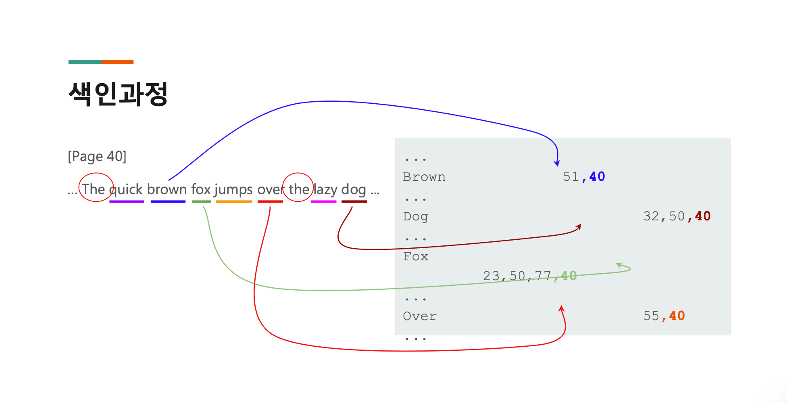
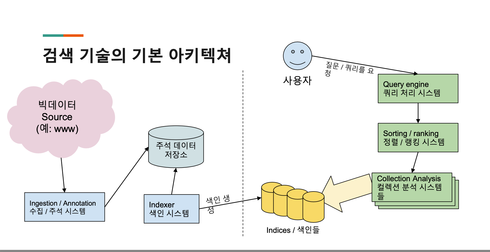
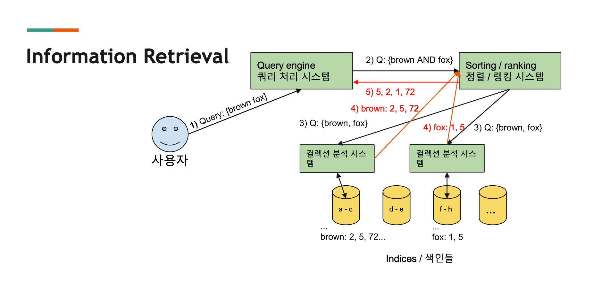

# Search Overview 

***

## 검색엔진 기술이란? 

컴퓨터 시스템에 저장된 정보를 찾는 걸 도와주는 시스템

***

## SQL, NoSQL 과 검색엔진비교 

왜 SQL 을 사용하지 않고 검색 엔진을 도입해야 하는가? 

이유는 총 3 가지가 있다.

- Scale

- Speed

- Usefulness 

SQL 은 트랜잭션을 지원해준다. 즉 ACID 한 특징을 부여해준다. 

NoSQL 은 이러한 특성을 주지 않는다. 대신에 더 좋은 Consistency, PartitionTolerance, Availability 를 제공해줄 수 있다. (CAP 이론)

- 현존하는 데이터베이스들은 3가지 중 두 가지만 제공해줄 수 있다는 것. 
- 검색엔진은 Availability 와 PartitionTolerance 를 추구한다. Consistency 를 제공하지는 않는다. (즉 갱신에 시간이 걸린다. 그리고 이 경우에 Consistency 가 제공되지 않을 수 있다.)
  - Partition Tolerance 는 클러스터 환경에서 노드끼리 통신이 단절되더라도 클러스터가 계속해서 작동함을 말한다.
  - Availability 는 하나의 노드가 장애가 나더라도 클라이언트가 응답을 받을 수 있음을 말한다.
- 요즘은 CAP 이론 보다 PACELC 라는 정리를 쓰기도 한다. 
  - CAP 이론에서 P 는 분산시스템의 네트워크 특성을 말한 것이다. 정확하게 분산 시스템의 특성을 말한건 아님.
  - 그리고 P 는 네트워크 장애가 일어났었을 떄와 일어나지 않았을 때를 명확하게 구별함이 필요하기 때문에 PACELC 를 말한 것. 
  - P 일떄는 Partition 상황이 발생했을 때, C (일관성) 을 위할 건지, A (가용성) 을 위할건지 선택해라. (일관성을 위한다면 실패해야겠지.)
  - E (else 로 P 가 아닐 때) 는 L (Latency) 를 고려할 지, C (일관성) 을 고려할지 선택해라 이런 뜻임. 

이로인해 SQL 은 일관적인 데이터를 볼 수 있게된다. 즉 Real Time 데이터를 볼 수 있다. (물론 격리에 따라 아주 약간의 차이는 있을 수 있다.)

검색엔진은 ACID 를 지원하지 않는다. 즉 데이터가 바뀌어도 반영되는데 시간이 걸릴 수가 있다. 

또 SQL 은 데이터가 많아질수록 검색이 느려진다. 인덱스를 아무리 타도 수평적탐색을 한다고하면 Linear Search 를 하기 떄문에. 

검색엔진은 데이터 사이즈에 영향을 받지 않는다. 

검색 엔진은 데이터가 추가되고 인덱싱되고 서빙되는데 꽤 시간이 걸린다. __(배치를 돌리므로)__

검색 엔진은 또 데이터 처리하는데 특화되어 있다. 고급 검색을 하는데 유용하다.

***

## 검색 엔진 시스템의 핵심 기술 

검색엔진 기술의 핵심은 인덱싱이다. (한국어로는 색인이라고 불린다.)

인덱스에는 stop word 에는 걸지 않는다. (의미없기 때문에.)

***

## 검색 엔진 기술 기본 아키텍처 

검색엔진의 기본 디자인 아키텍처를 보자. 

먼저 엄청난 데이터를 제공해주는 빅데이터 소스가 있다. __(raw data 를 제공해준다.)__

이러한 빅데이터를 가공하고 필요한 키워드들을 추출하고 Annotation 을 달고 추가 데이터를 첨부하는 수집/주석 시스템이 있다.

이러한 수집/주석 시스템은 가공한 데이터들을 주석 데이터 저장소에 적재한다. 

이렇게 저장된 데이터들은 인덱싱 시스템에 의해서 인덱싱이 된다. (인덱싱은 annotation 과 키워드들에 걸릴 수 있겠다.)

인덱싱 시스템이 처리한 데이터들은 인덱스들로 이뤄져서 저장이 된다. 

이렇게 저장된 데이터들은 Serving 해주는 어플리케이션이 다루기 굉장히 쉽다. 

이 데이터들은 Collection Analysis 시스템 (= 컬렉션 분석 시스템) 이 가져오도록 한다. 

처음 사용자가 요청한 쿼리는 쿼리 처리 시스템이 서빙 시스템이 이해하기 십게 다시 재분석해준다. 

이렇게 처리된 쿼리들은 Sorting/Ranking 시스템들이 여러가지 Collection Analysis 시스템에 요청하게 해서 데이터들을 가져오게되고 가져온 데이터들은 Sorting/Ranking 시스템에 의해서 머지되고 정렬된다. 

즉 Collection Analysis 시스템은 여러 곳곳에 분산되서 저정된 색인들을 가져오는 역할을 하게되고 

Sorting/Ranking 시스템은 Collection Analysis 시스템이 가져온 데이터들을 Merge 해서 제일 Useful 한 결과를 만들어서 주게된다. 

예를들어서 다시보자. 

사용자가 brown fox 라는 쿼리를 했다고 가정해보자. 

쿼리시스템은 brown fox 라는 자연어 텍스트를 서빙 시스템이 다루기 쉽도록 brown AND fox 라는 방식으로 변형해준다. 

이 다음 Sorting/Ranking 시스템들은 brown fox 라는 단어들을 보고 해당 단어들이 있을 수 있는 Collection Analysis 시스템에 보내게 된다. 

Collection Analysis 들은 인덱스가 Topological sorting 이 되어있기 때문에 Sorting/Ranking 시스템은 알 수 있다. 

Collection Analysis 들은 각각에 저장소에 있는 데이터들을 Sorting Ranking 시스템에 전달해주면 하나로 뭉쳐서 제일 유용한 결과를 만들고 돌려준다. 

brown 이라는 단어가 2, 5, 72 page 에 저장되어 있고 

fox 라는 단어가 1, 5 page 에 저장되어 있다면 5페이지에는 brown 과 fox 가 둘 다 있다는 뜻이다. 

그래서 5 페이지가 더 높은 랭킹을 가질 수 있는 확률이 높을 것. 

만약에 여기서 brown fox 가 브랜드 이름이라고 해보자. 이 경우라면 fox 가 brown 바로 뒤에 오는 것이 더 적합할 경우이기 떄문에 fox 가 brown 앞에 오는 문서는 중요도가 낮을 수 있다. 

이런식으로 랭킹을 정리하는 것도 가능하다.
 

***

## 실리콘밸리에 검색 기술 활용 사례 

Quora 는 실리콘 밸리의 지식인 이다. 

- 질문 뿐 아니라 질문 속 단어를 추출해서 그와 연관있는 질문을 찾고 답까지 한번에 검색창에서 보여줄 수 있다. 

Pinterest 는 이미지 검색을 제공해준다.

- 이미지의 여러 속성을 이용해서 검색하면 이미지를 찾아준다. 

Soundhound 는 음원검색을 제공해준다.

- 스마트폰으로 자기가 듣는 음악을 녹음하면 자신이 찾고자 하는 음악을 찾아준다. 

23andMe 는 DNA 검색을 제공해준다. 

- 나와 가장 가까운 DNA 를 가진 사람을 찾아서 제공해준다. 
